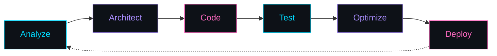

<div align="center">


<br>


<br><br>


</div>

<br>

<div align="center">

</div>

<br>

## `⚡ System Info`

```text
┌───────────────────────────────────────────────────────────┐
│                                                           │
│  OPERATOR    : OVI ISLAM ABIR (ABIR)                      │
│  ROLE        : FULL-STACK SOFTWARE ENGINEER               │
│  ACADEMICS   : CSE STUDENT @ BUBT                         │
│  FREELANCE   : FIVERR FREELANCER (E-COMMERCE & WEB APPS)  │
│  LOCATION    : DHAKA, BANGLADESH                          │
│  STATUS      : BUILDING & SHIPPING                        │
│                                                           │
└───────────────────────────────────────────────────────────┘
```

> `// "Code is raw energy; architecture gives it form."`

<br>

## `🧬 About`

- 🎓 **Academic base:** CSE student at **BUBT**, Dhaka
- 💻 **Engineering core:** Full-Stack Developer — **React / Next.js / Node.js / Express**
- 🛍️ **Commercial work:** Fiverr Freelancer — e-commerce storefronts, payment modules, web apps
- 🌱 **Currently:** deep in **Prisma ORM + PostgreSQL** backend optimization
- ⚡ **Also exploring:** microservice architectures & automation

<br>

## `🛠️ Tech Stack`

<div align="center">

**Frontend**
<br/>


<br><br>

**Backend**
<br/>


<br><br>

**Database & Cloud**
<br/>


<br><br>

**Tools**
<br/>


</div>

<br>

## `📊 GitHub Analytics`

<div align="center">


<br><br>


</div>

<br>

## `📁 Project Directory`

| Area | What's in it |
|---|---|
| 🛒 E-Commerce Apps | Storefronts, cart & checkout flows, admin dashboards |
| 🏠 RentNest Platform | Rental marketplace — landlord/tenant roles, payments & reviews |
| 🔌 REST API Engines | Node/Express services with JWT auth & database layers |
| 🔐 Auth Protocols | Role-based access control, JWT, OAuth |
| 🧩 R&D Labs | Full-stack experiments & Next.js SSR/SSG benchmarks |

<br>

## `🔄 Development Flow`



<br>

## `🐍 Contribution Snake`

<div align="center">


</div>

<br>

## `🤝 Connect`

<div align="center">

<a href="https://github.com/OviIslamAbir"></a>
<a href="https://my-portfolio62.netlify.app"></a>
<a href="https://www.fiverr.com"></a>

</div>

<br>

<div align="center">

```text
┌───────────────────────────────────────┐
│                                       │
│  BUILD.  BREAK.  DEBUG.  REPEAT.      │
│                                       │
│  SYSTEM: ABIR_OS  //  STATUS: ONLINE  │
│                                       │
└───────────────────────────────────────┘
```


<br>


</div>
