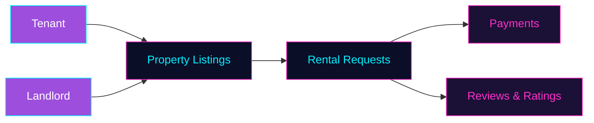

 

 

 

## `⚡ About`

- 🎓 CSE Student at **BUBT**
- 💻 Full-Stack Developer specializing in **React / Next.js / Node.js**
- 🛍️ Fiverr Freelancer — E-commerce sites & web apps
- 🌱 Currently deep in **Prisma + PostgreSQL** backend architecture
- 📫 Reach me through the links at the bottom

 

## `🛠️ Tech Stack`

  

  

  

 

## `📊 GitHub Stats`

  

 

## `🚀 Featured Project — RentNest`

**A full-stack rental property marketplace connecting tenants and landlords.**

**Key features:** Property search & filtering · Tenant/landlord roles · Rental requests · Auth & authorization · Payment integration · Reviews & ratings · Admin panel

**Stack:**     

 

## `📁 Other Work`

| Area | What's in it |
|---|---|
| 🛒 E-Commerce Apps | Storefronts, cart & checkout flows, admin dashboards |
| 🔌 REST APIs | Node/Express services with auth & database layers |
| 🔐 Auth Systems | JWT-based login, role-based access control |
| 🧩 Experiments | Small full-stack projects to try new tools |

 

## `🐍 Contribution Snake`

> If this doesn't render, the snake workflow hasn't been added to your profile repo yet — ping me and I'll set it up.

 

## `🤝 Connect`

 

 

